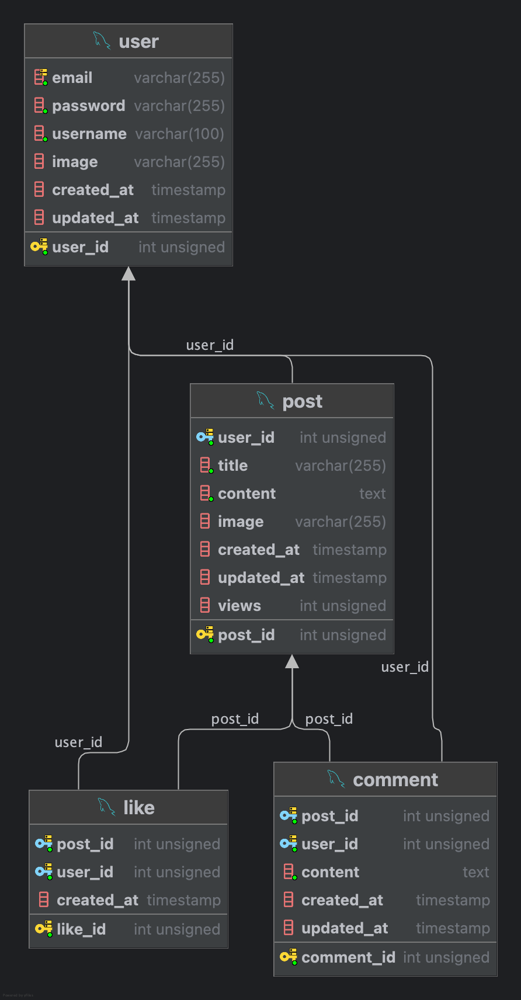

# Covy Community Backend

## 🚀 시작하기

1. git clone https://github.com/mingoo36/5-covy-lee-community-be.git

2. npm install
   
3. node app.js

4. [DB 생성 가이드] (https://github.com/mingoo36/5-covy-lee-community-be/blob/master/config/DB.sql)
   
